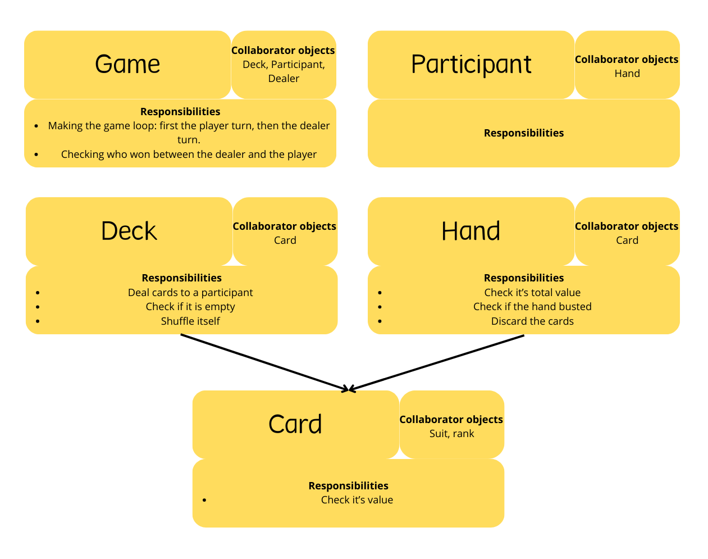
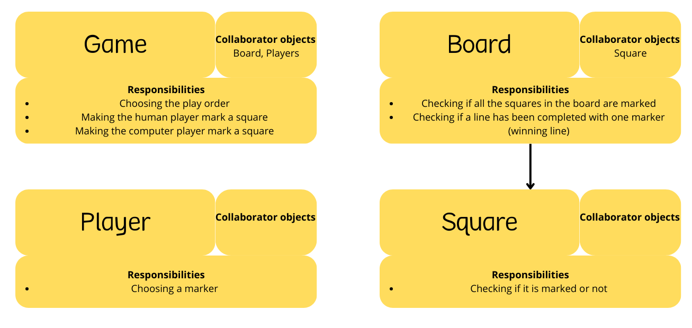
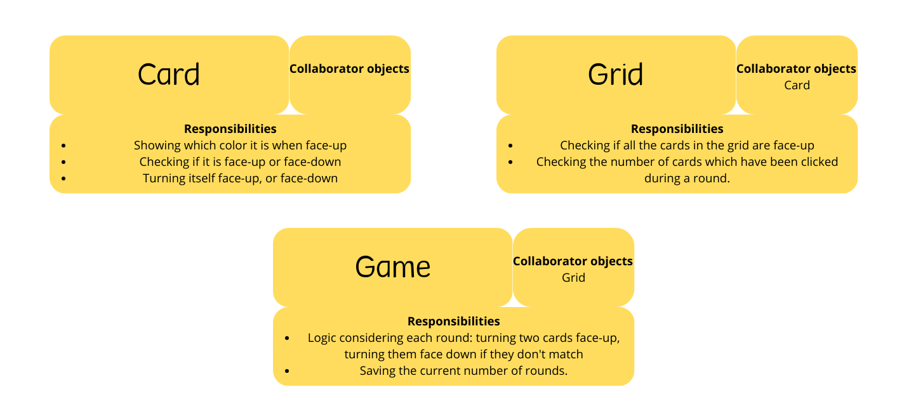

# Projects
## Table of contents
- [Running the Applications](#running-applications)
   * [Ruby Apps](#ruby-apps)
      + [With a Gemfile](#with-a-gemfile)
      + [Without a Gemfile](#without-a-gemfile)
   * [Javascript Apps](#javascript-apps)
- [Twenty One](#twenty-one)
   * [Introduction](#twenty-one-intro)
   * [Implementation](#twenty-one-implementation)
- [Tic Tac Toe](#tic-tac-toe)
   * [Introduction](#tic-tac-toe-intro)
   * [Implementation](#tic-tac-toe-implementation)
   * [Additional implementations](#tic-tac-toe-additional-implementations)
   * [Further steps to implement](#tic-tac-toe-further-steps)
- [File-based CMS](#file-based-cms)
   * [Introduction](#file-based-cms-intro)
   * [Implementation](#file-based-cms-implementation)
- [Todo App](#todo-app)
   * [Introduction](#todo-app-intro)
   * [Implementation](#todo-app-implementation)
- [Budget App](#budget-app)
   * [Introduction](#budget-app-intro)
   * [Implementation](#budget-app-implementation)
- [Memory Game](#memory-game)
   * [Introduction](#memory-game-intro)
   * [Implementation](#memory-game-implementation)
   * [Further steps to implement](#memory-game-further-steps)

## Running the Applications 
### Ruby Apps 
#### With a Gemfile 
1. Install the necessary gems: `bundle install`
2. Execute the app: `bundle exec ruby program.rb` (where 'program' is to be replaced by the actual filename). There sould be a line like `Listening on ..`: this is the URL to open on the web browser.
#### Without a Gemfile 
1. `ruby program.rb` (where 'program' is to be replaced by the actual filename).

### Javascript Apps 
Either open the html file with a browser, or, from the folder containing the html file, run `npx http-server -p xxxx` then go to `http://localhost/xxxx` ('xxxx' is the port number used, for example '8080').

## Twenty One 
### Introduction 
Twenty-One is a solo game, with rules similar to Blackjack, but simplified. The player and the dealer are given each two cards, with one card from the dealer being concealed. The goal of each participant is to draw cards to get as close to 21 without busting (i.e having a score greater than 21). At any point, the player can choose to draw or to stay (i.e stop drawing cards). If the player busts, it is an automatic win for the dealer. Then it is the dealer's turn: he reveals it's concealed card, and has to draw until its score is at least 17. The winner is the one who gets closer to 21, and if both players have the same score, it is a draw.

Each card has the value of the rank indicated, except for figure cards and Ace. The figure cards count as 10, and the Ace count as 10 or 1, depending on which one provides a total closest to 21 without going beyond.

### Implementation 
Given the description of the problem, I came up with the following CRC cards:

Given the fact the the participant had no responsibilities, and that I could accomplish everything I needed easily for the hand class with an Array, I decided to get rid of the `Hand` class, and put its responsibilities in `Participant` class. I later chose to add also subclasses of `Participant`: `Player` and `Dealer`, for clarity purposes. I also found unnecessary to provide custom classes for suits and ranks, and stuck with Strings.  

The most tricky part was to decide if the Ace card was of value 11 or 1. I first thought of comparing each combinations of values for the Aces. For example, if there are two Aces in the hand, they could be both of value 11, both of value 1, or one could be of value 11, and the other 1. I would then add the potential values of the Aces to the rest of the hand value, and determine which one would come closest, but below or equal 21.
I later found out that I could simply add 11 to the hand value without the aces, and then check if this potential value busted. If so, I would change the value of the ace to 1. 
In the end, I chose to assume that the ace had a value of 11. Then for each ace, if the hand value was busting, I would subtract 10 to the total value, effectively making the value of the Ace, 1.

## Tic Tac Toe 
### Introduction 
Tic Tac Toe is a 2-player game, played traditionnally on a 9x9 grid. Each player has a different token, and each one places them on the grid, in alternance. The goal of the game is to make a vertical, horizontal or diagonal line with the player's token. If the grid is full and no player succeeds, it is a draw.

In the beginning, I chose to only use 1 player, and make the other player the computer, as this would allow me to implement an IA. Then at the end of the project, I added the possibility to add as many humans and computers as desired (see Additional implementations).

This program only uses a console (for now), and not a web browser.

### Implementation 
The first task was to find what were the lines of the board. I chose to hard-code the lines as there were only 8 of them: 3 horizontals, 3 verticals, 2 diagonals. Later, when I added the possibility to change the board size, I used a more logical approach., based on the squares IDs.

I then had to choose the player order, and then make each player move, switching the current player after each move. For that, I needed to keep track of the current player. I added an instance variable in the `Game` instance, with the current player object inside.  
As well, to check that a line has been completed, I checked all the lines, and if a line was full and with only one marker, the game was won. 

The most interesting part was to implement an IA for this game.  
I used a simple IA with defensive moves and offensive moves. The logic was the same for both. If a line was almost completed by one player, the IA would choose the remaining square of the line. That means that if it was the human player marker, it would prevent him from completing the line and winning; if it was the computer marker, it would make him win.
The center square of the board is the most crucial to play, because it is part of of 4 lines in total: the 2 diagonals, 1 horizontal, 1 vertical line. All the other squares are only involved in 2 lines: 1 vertical, 1 horizontal. As such, I also implemented the IA to play this square in priority.

So I had 3 set of moves: offensive choices, defensive choices, and central square choices. I add to make a priority order for each of those choices. As the offensive choices would directly make the computer win the game, they were to have top priority. Then the defensive choices would follow, because otherwise the human player would win on the next turn. Finally, if neither offensive nor defensive choices were apparent, the IA would choose the center square. And if the center square was taken, it would choose randomly one of the remaining squares.

I then added a more advanced IA, using the <b>Minimax Algorithm</b>.

The minimax algorithm is a look-ahead algorithm which uses <i>recursion</i>. For this algorithm, we need a way to quantify the advantage one player has. Traditionally, a win would be +Infinity, a loss -Infinity, and a draw 0.  
Our function needs the following parameters: the current position, the maximizing player, and the depth at which the algorithm will look ahead. Let's look in more detail at those:
- the current position in our case is the board at the current state
- the maximizing player is traditionnally the one that we want to win, in this case the computer
- Tic Tac Toe needing only 9 moves from beginning to end, it is easy enough to not take the depth parameter into consideration. If we chose to add it, we could put a value of 0 if the board at the final depth would still be uncertain.  

So the algorithm will look at each possible move from the current position. It will assume each player will make the best move possible. So the maximizing player will try to go for the move with highest value, and the minimizing player the move with the lowest value. (remember that +Infinity is a win for the maximizing player and -Infinity is a win for the minimizing player).  
If a move leads to a final board state, meaning that one player wins, the value of the move is then +/-Infinity depending on the winner. If the move leaves the board in an uncertain state, the algorithm will <b>call itself</b> taking into consideration this possible move. The maximizing player does not change, so if on the current call, we were trying to maximize, on the recursion call we will try to minimize and vice-versa. In order to implement this, <b>I chose to add the current player into the list of parameters, switching to the other after the possible move. I also didn't put the current state of the board directly, but separated it into the move which leaded to the current state of the board. For simplicity, I also made a win being +1 instead of +Infinity, and a loss -1 instead of -Infinity.</b>  
Because the maximizing player doesn't change throughout the game, I could remove it from the list of parameters. So finally, the parameters I have for this function are:
- the current state of the board
- the candidate move
- the current player.
The function will determine the minimax value for the board <i>after</i> the current player made the candidate move.

### Additional implementations 
- add as many human and computer players as the user want, and add a default marker for each. Add the possibility to add a custom marker for each as well
- Keep a score for each player, and make a tournament with a player reaching a certain score the winner
- Have a custom board size

### Further steps to implement 
- add pruning to the Minimax algorithm to make it more efficient

## File-based CMS 
### Introduction 
A CMS (Content Management System) is an app used to manage the content of a website. More specifically, a file-based CMS is used to manage the static assets such as text files or images.

### Implementation 
This app can recognize text files (`.txt`, `.md`, `.markdown`), and images (`.jpg`, `.png`, `.bmp`, etc.)  
All files imported can be viewed by clicking on the file name. To render markdown files (`.md` and `.markdown`), I used the `redcarpet` gem.
  
The files can be viewed by anyone, but to edit or delete them, you need an account. I saved the login and password into a yaml file. At first I stored the password in plain text, but this was unsafe because all the username-passwords pairs could be accessed if someone could open the data file. To prevent the passwords to be directly accessed, I encrypted them using hashing.  
Hashing consists of taking the password as input and encrypting it. The resulting encryption cannot be reverted to the password, effectively making hashing a <i>one-way function</i>. One thing to note is that different inputs could lead to the same output after being passed to the hash function: this is called a <i>collision</i>. In practice, we choose a hash function that minimizes collisions.  
One potential issue however, is that hackers can use hash tables : precomputed table of hashed passwords. (A more advanced alternative to hash tables would be rainbow tables, which checks for more passwords by using transforming the hashed password into another plain-text password, and then re-hasghing it, for a number of times.) If he gets access to the database file, he can use a hash table of commonly used password, and check them against the database file.  
A good way to counter rainbow tables is by adding a <i>salt</i>. Before the hashing process, a salt is prepended to the plain-text password, making it much more difficult for a malevolent individual to use hash tables. He would have to use a different hash table for each potential salt, making the process much more difficult. In practice, I used `BCrypt`, which uses hashing and salt.

## Todo App 
### Introduction 
A todo app is a commonly used application which is the computed version of making a todo-list. It is used by the user to manage tasks that has to be done.

The app consists of creating todo lists, with a list of tasks inside those lists. Upon creating a todo list, the user is sent to a form to decide the name of the list. Then by clicking at the list item, he can then manage the tasks for that list: creating todo items, updating them and delete them. Deleting a list is possible in the editing page for this list.
### Implementation 

I first stored the lists inside a <b>cookie</b>. Sinatra permits the use of sessions to store data and prvides a way to build a stateful web application. By default, HTTP is a <i>stateless protocol</i>, meaning that the data stored is lost by issuing a new request (such as going to another page). Using sessions solve that issue. 
One issue with session is that a malevolent individual could find the session secret. Instead of having a fixed session secret, it is better to generate it randomly. I used the `sysrandom` gem to create a 64-byte session secret, as recommanded in the Sinatra documentation.   
Later, I used AJAX (Asynchronous Javascript and XML) and also used <b>jQuery</b>. Because a list item could only be deleted from the update page of this list, it made sense to redirect back to the list of todo lists after deleting one. However, I could delete todo items asynchronously without having to reload the page. The first step was to know whether I was deleting a todo list or a todo item, being that both of them were tracked with the `delete` HTML class. I returned the <i>status code</i> of 204 instead of 200 when a todo item was deleted. 204 means that nothing needs to be done and that the browser can stay in the current page. Then using AJAX, I removed to todo element.   
One security issue I had to address was cross-site scripting: by adding html code inside the name of a todo list or todo item, a hacker could inject it and modify the app behavior. This is also troublesome because he can then, by guessing the structure of the app, access the source code of its files, for example. 
The way to fix it was to <b>sanitize the user input</b>. I could escape HTML every time a user input was present, but this can easily leads to mistakes, by forgetting to escape a particular HTML input.
Instead, I choose to escape HTML by default, and only allow it when I needed to. as I only needed to disable HTML escape in the layout, which made this solution far more simple and secure. 

## Budget App 
### Introduction 
A budget app is used to keep track of expenses and revenues. The app gives the possibility to add a particular expense or revenue to a particular type, like groceries for expenses, or main income for revenues
### Implementation 
The implementation of the Budget App was very similar to the Todo App and was relatively straightforward. One difference is that I used a database with <b>PostgreSQL</b> instead of cookies to store data.

## Memory Game 
### Introduction 
The memory game is a game in which the goal is to find pair of cards with the same color. Cards are disposed in a grid, and at each round, the player can turn face-up a pair of cards. If the card colors' match, they stay face-up, otherwise they return face-down. Once every card has been matched, the game ends.
### Implementation 
I decided to use Object-Oriented Programming for the logic portion of the app, using Javascript and jQuery. After using a spike to define the problem, I used the Grid, Card and Game classes. I considered using a Player class as well, but the idea was quickly abandoned considering there was only one player for this application. 
Here are the CRC cards:

 
The implementation of the `Card` class was straightforward. I used numbers instead of colors when creating them inside the grid constructor, as it would allow changing the colors easily if needed to. Then I used a Card method to convert the number to an actual color.  
The first challenge I faced was to make the grid itself. I would push the cards inside an array, but they would not be shuffled, and there are not Array methods that would allow me to shuffle the elements easily. I could use the `Math.random() - 0.5` as the function of `Array.prototype.sort()`, but due to the way the sort function works, certain shuffle configurations would appear more often than others. The <b>Fisher-Yates shuffle</b> was appropriate for my needs.  

On the HTML side, I displayed the grid, with each element being a square. The user interaction would be to click on a square to reveal what color it is.  
So in the Game class, I implemented what would happen when a user clicked on a square. The first step was to display the card color when it was clicked. I used jQuery for modifying the CSS and changing the color of the square.
The next step was to compare the cards when two of them was clicked. I first added a property in `Card` to check if the card was clicked or not, and then I could check the Grid object to see whether two cards were clicked or not.  

Another challenge worth noting was that when the two cards didn't match, I had to display them for a certain amount of time, then hide them again, without giving the user the possibility to click another card in the meantime. The tricky part was the second one, because the function I used for displaying the cards was <i>asynchronous</i>, meaning that the user could still click other cards. It didn't break the application, but it was not what I intended. To resolve that, I used a property in the Game object, `lastClickDate`, which saved the time at which two cards were matched. Each time the user would click, I would also save the time into a local variable, `currentClickDate`. Then I simply had to make sure that the difference of time between `currentClickDate` and `lastClickDate` were beyond the time the cards were displayed in order to allow the click function to run.

### Further steps to implement 
- Being able to change the grid size. 
- Gaving the possibility to have more than one player. Each player could have its own grid, or both could use the same grid. In the latter case, after one player reveals a pair of matching cards, he will play the next round again. Otherwise, the round is played by another player.
- Displaying the number of rounds in real time.

